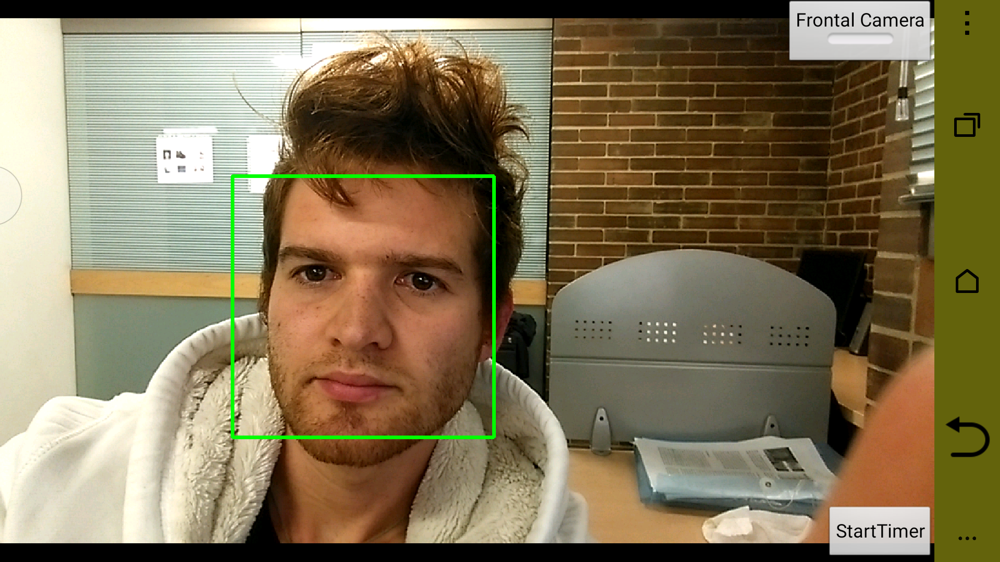
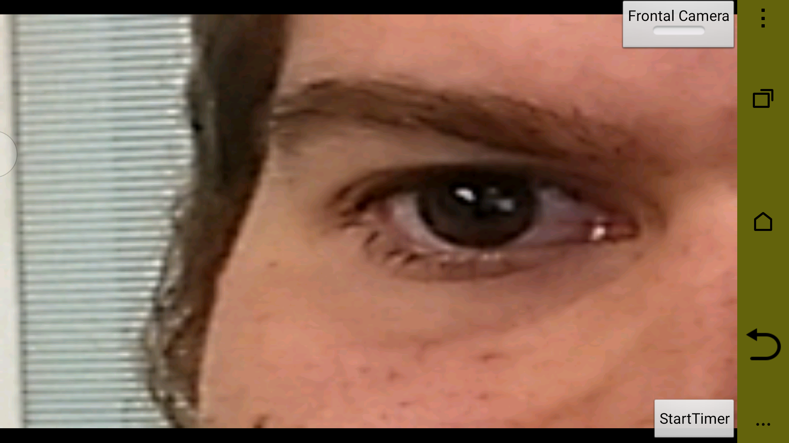
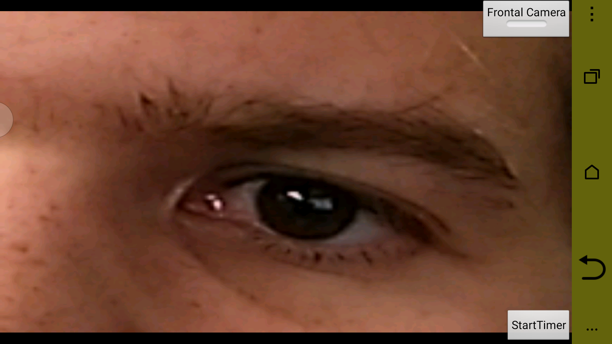
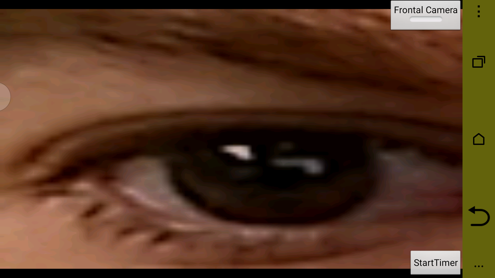
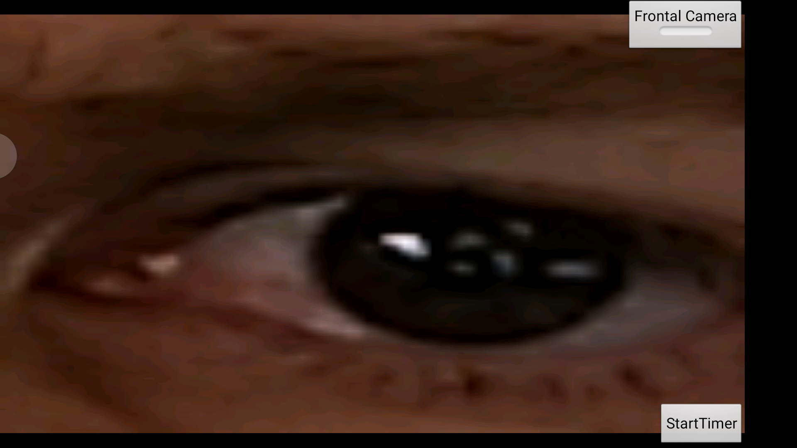
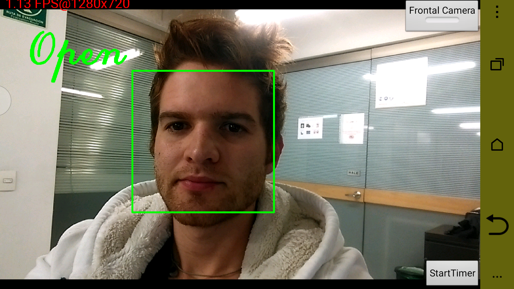
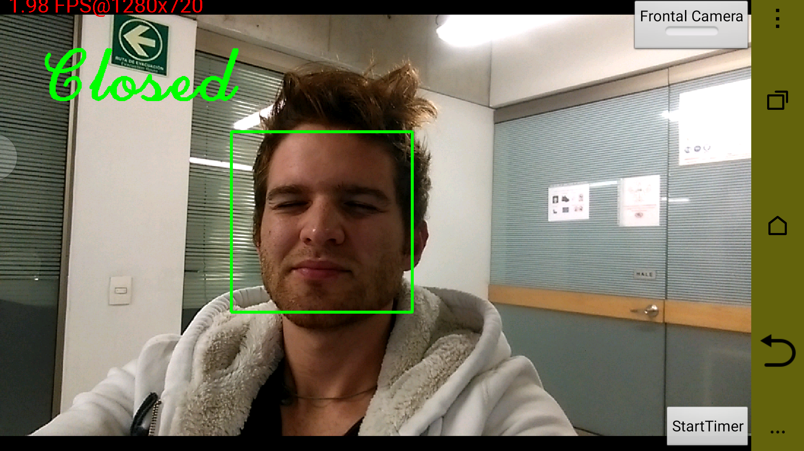

## OpenCV-Projects 
# it has code and APK for binary classification of Open/Closed eyes.

This work develop 3 stages in order to classify Open/Closed Eyes.

For each frame, let's say:

1. Face detection - LBP it is performed:

- Then changing ROI

- Then both eyes are located according to geometry of the face

- Now changing ROI for each eye

Left Eye

Right Eye

2. Eye detection - Haar it is performed (Different detector for each one), and we got:

    Left Eye

    Right Eye

3. Binary classification according to both eyes:

